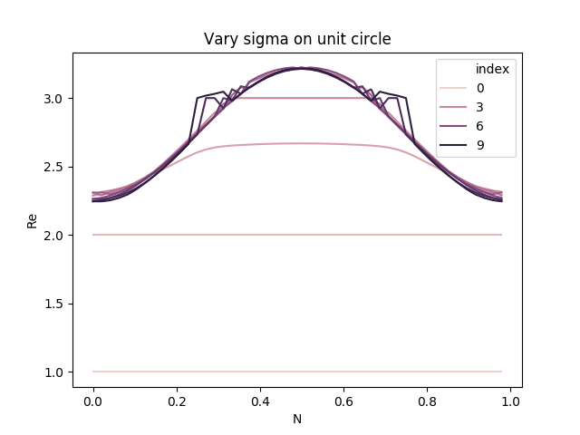
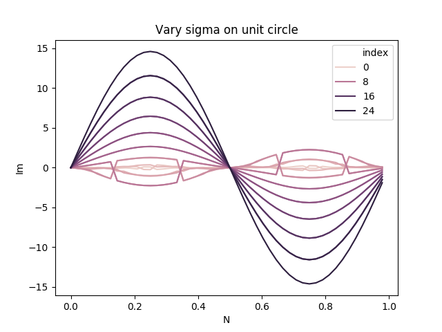

# Adding Kernel

## Model

### Large-Mass Harmonic Oscillator (LM_HO)
Model with action
Using the model with the action
$$
    S = \frac12 \sigma x^2
$$
with the Fokker-Planck operator
$$\begin{aligned}
    H_{FP} =& \Gamma(x) \left[ \frac{\partial^2}{\partial x^2} - \frac{\sigma^2 x^2}{4}  + \frac\sigma2 \right] \\
    &+ \frac{\partial \Gamma(x)}{\partial x} \left[ \frac{\partial}{\partial x} + \frac12\sigma x \right]
  \end{aligned}
$$

For constant Kernel: $\Gamma(x) = \Gamma$.
$$
H_{FP} = \Gamma \left[ \frac{\partial^2}{\partial x^2} - \frac{\sigma^2 x^2}{4} + \frac\sigma2 \right] 
$$

## $\sigma$ on unit circle

### Langevin Simulation
We did a Langevin simulation on the LA_HO model above, for $\sigma$ varying on the unit circle in the complex plane. 

#### Langevin equation
General Kernelled complex Langevin equation for an action $S(x)$
$$
  \dot z(t) = -K(z) \frac{\partial S(z)}{\partial z} + \frac{\partial K(z)}{\partial z} + \sqrt{K(z)}\eta(z,t)
$$
where t is the fictitious time and the nois term $\eta$ satisfy (real gaussian white noise)
$$
  \langle \eta(z,t) \rangle = 0, \quad \langle \eta(t)\eta(t') \rangle = 2\delta(t-t')
$$

The Kernelled complex Langevin equation for the LA_HO model and constant kernel is:
$$
  \dot z = -K\sigma z + \sqrt{K}\eta
$$

### Simulation
The simulation was carried out with a dicretization in the fictitious time of $dt = 0.01$, with 2000 updates ($N_f$) and running 64 samples. 

The model parameter $\sigma$ was 

$K=1$           |  $K=\sigma^*$
:-------------------------:|:-------------------------:
 |  

### Fokker-Planck Eigenvalues

$K=1$           |  $K=\sigma^*$
:-------------------------:|:-------------------------:
 |  
 |  
 |  

### Results for the modified Fokker-Planck $H_{\textrm{FP}}$

First I used the 
$$\begin{aligned}
H_{\textrm{FP}} =& e^{\frac12 S(x)} F_{\textrm{FP}}e^{-\frac12 S(x)} \\
=& e^{\frac12 S(x)} \frac{\partial}{\partial x} \Gamma (x)\left( \frac{\partial}{\partial x} + \frac{\partial S(x)}{\partial x} \right)e^{-\frac12 S(x)}
\end{aligned}
$$ as the Fsokker-Planck operator. But of course this is not the right operator to evaluate the eigenvalues of. Under is the results for $H_{\textrm{FP}}$ 
#### Re $\lambda_n$

$K=1$           |  $K=\sigma^*$
:-------------------------:|:-------------------------:
 |  
 |  
 |  

#### Im $\lambda_n$

$K=1$           |  $K=\sigma^*$
:-------------------------:|:-------------------------:
 |  
 |  

