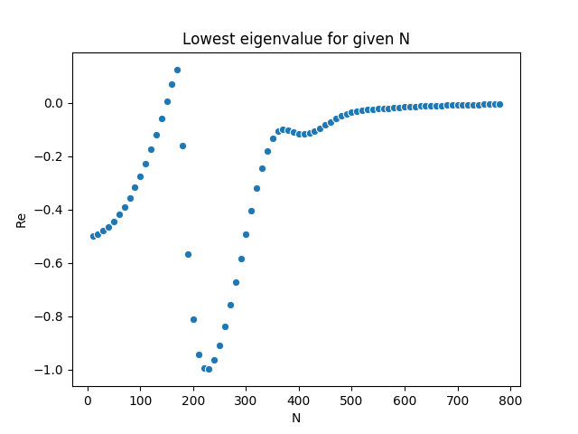

# Lowest Eigenvalue

Eigenvalue problem:
$$
    H_{\textrm{FP}}(x) \psi_n(x) = -\lambda_n \psi_n(x)
$$

The lowest eigenvalue should be $\textrm{Re } \lambda_0 = 0$, and therefore have a distribution following $e^{-\frac12 S}$.

## Model

Using the model with the action
$$
    S = \frac12 \sigma x^2 + \frac14 \lambda x^4 
$$

with the Fokker-Planck operator
$$\begin{aligned}
    H_{FP} =& e^{\frac12 S(x)} \frac{\partial}{\partial x} \Gamma (x)\left( \frac{\partial}{\partial x} + \frac{\partial S(x)}{\partial x} \right)e^{-\frac12 S(x)} \\
    =& \Gamma(x) \left[ \frac{\partial^2}{\partial x^2} - \frac{\sigma^2 x^2}{4} + \frac{3 \lambda x^2}{2} - \frac{\sigma \lambda}{2}x^4 - \frac{\lambda^2}{4}x^6 + \frac\sigma2 \right] \\
    &+ \frac{\partial \Gamma(x)}{\partial x} \left[ \frac{\partial}{\partial x} + \frac12(\sigma x + \lambda x^3) \right]
  \end{aligned}
$$

For now we set the kernel independent of $x$: $\Gamma(x) = \Gamma$.
$$
H_{FP} = \Gamma \left[ \frac{\partial^2}{\partial x^2} - \frac{\sigma^2 x^2}{4} + \frac{3 \lambda x^2}{2} - \frac{\sigma \lambda}{2}x^4 - \frac{\lambda^2}{4}x^6 + \frac\sigma2 \right] 
$$

### Discitization
When discritizing summation by parts (http://oddjob.utias.utoronto.ca/dwz/Miscellaneous/SBP_SAT_review.pdf) are used on the double derivative for the boundary condition. The 4(2) order approximation is used, i.e., 4th order approximated finited difference on all but the top and lover square (boundary condition) where it is 2 order approximation.

Setting up with the 4 parameters:
* N: number of dicretization points
* $x_{\textrm{min}}=-100$, $x_{\textrm{max}}=100$: configuration space
* $\sigma = 1 + 0i$
* $\lambda = 2$

### Running tests with varying N
The result of the caluclation of $\lambda_0$ for N=10 to N=500 with a stepsize of 10 is shown i the picture below:

One can see that the real part of the lowest eigenvalue is in general negativ, i.e., it does not follow the theoretical prediction that this should always be positive. As this value is varying, and somtime also positive, it could be that the accuracy when doing the discritization is not good enough until one goes to $N>500$.

