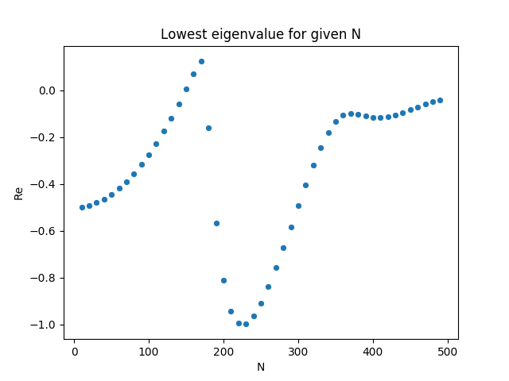
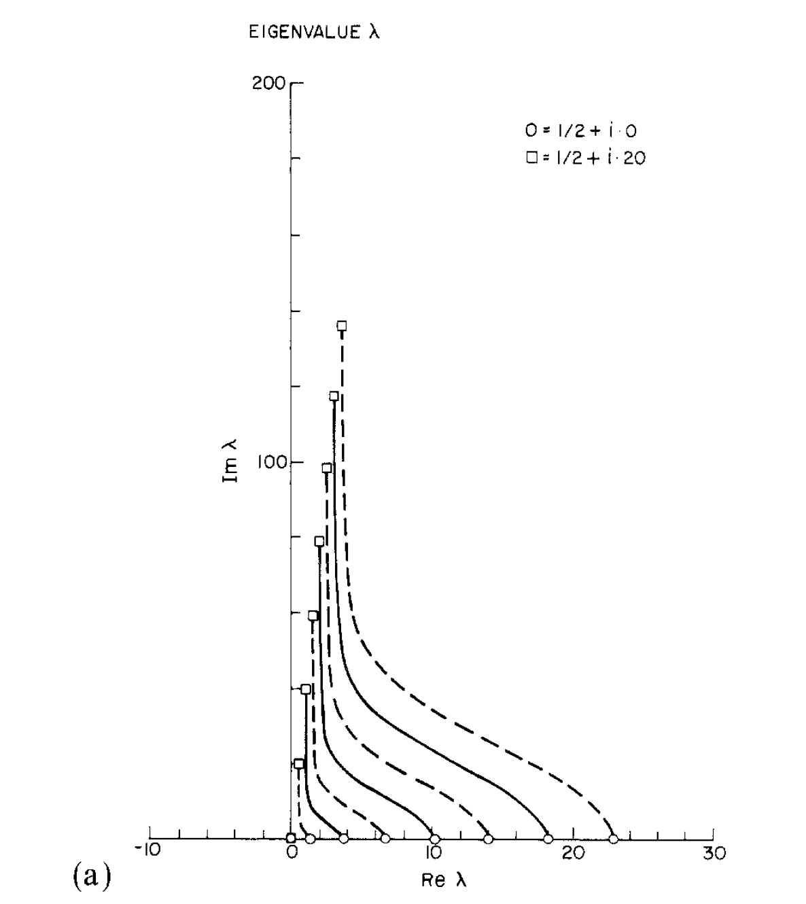
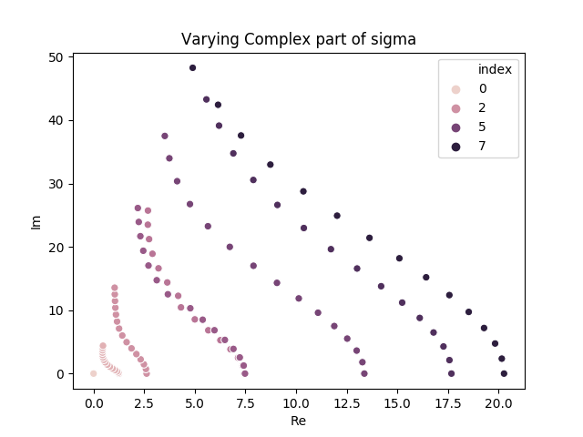

# Lowest Eigenvalue

Eigenvalue problem:
$$
    H_{\textrm{FP}}(x) \psi_n(x) = -\lambda_n \psi_n(x)
$$

The lowest eigenvalue should be $\textrm{Re } \lambda_0 = 0$, and therefore have a distribution following $e^{-\frac12 S}$.

## Model

Using the model with the action
$$
    S = \frac12 \sigma x^2 + \frac14 \lambda x^4 
$$

with the Fokker-Planck operator
$$\begin{aligned}
    H_{FP} =& e^{\frac12 S(x)} \frac{\partial}{\partial x} \Gamma (x)\left( \frac{\partial}{\partial x} + \frac{\partial S(x)}{\partial x} \right)e^{-\frac12 S(x)} \\
    =& \Gamma(x) \left[ \frac{\partial^2}{\partial x^2} - \frac{\sigma^2 x^2}{4} + \frac{3 \lambda x^2}{2} - \frac{\sigma \lambda}{2}x^4 - \frac{\lambda^2}{4}x^6 + \frac\sigma2 \right] \\
    &+ \frac{\partial \Gamma(x)}{\partial x} \left[ \frac{\partial}{\partial x} + \frac12(\sigma x + \lambda x^3) \right]
  \end{aligned}
$$

For now we set the kernel independent of $x$: $\Gamma(x) = \Gamma$.
$$
H_{FP} = \Gamma \left[ \frac{\partial^2}{\partial x^2} - \frac{\sigma^2 x^2}{4} + \frac{3 \lambda x^2}{2} - \frac{\sigma \lambda}{2}x^4 - \frac{\lambda^2}{4}x^6 + \frac\sigma2 \right] 
$$

### Discitization
When discritizing summation by parts (http://oddjob.utias.utoronto.ca/dwz/Miscellaneous/SBP_SAT_review.pdf) are used on the double derivative for the boundary condition. The 4(2) order approximation is used, i.e., 4th order approximated finited difference on all but the top and lover square (boundary condition) where it is 2 order approximation.

Setting up with the 4 parameters:
* N: number of dicretization points
* $x_{\textrm{min}}=-100$, $x_{\textrm{max}}=100$: configuration space
* $\sigma = 1 + 0i$
* $\lambda = 2$

### Running tests with varying N
The result of the caluclation of $\lambda_0$ for N=10 to N=500 with a stepsize of 10 is shown i the picture below:

One can see that the real part of the lowest eigenvalue is in general negativ, i.e., it does not follow the theoretical prediction that this should always be positive. As this value is varying, and somtime also positive, it could be that the accuracy when doing the discritization is not good enough until one goes to $N>500$.

#### Update on N>500
Her is the same plot as above only on N>500. The eigenvalues for N>500 increase towards 0, which can mean that for $N\rightarrow \infty$ then $\textrm{Re } \lambda_0 \rightarrow 0$.

### See that eigenvalues are not exact. 
From papers calculating the same eigenvalues, the eigenvalues can be compared to see if they are the same. Comparing with (Klauder 1985: J.Stat.Phys. 39 (1985) 53-72) in the picture below:
.

The plot above varies the sigma parameter in the action. The vayway theave calculated the eigenvalues is by expanding the psobability distribution in the Harmonic Oscillator energy states. 

The figure above show that the eigenvalues follow the same pattern as for Klauder 1985. This is for the 8 first eigenvalues, and sigma is varied from $\sigma=1+0i$ to $\sigma=1+15i$. For higher imagenary part of the sigma, the pattern dissapear:

which could mean that we need a higher number of discretization points or a higher second derivative approximation order. The plots above is for $N=500$.

