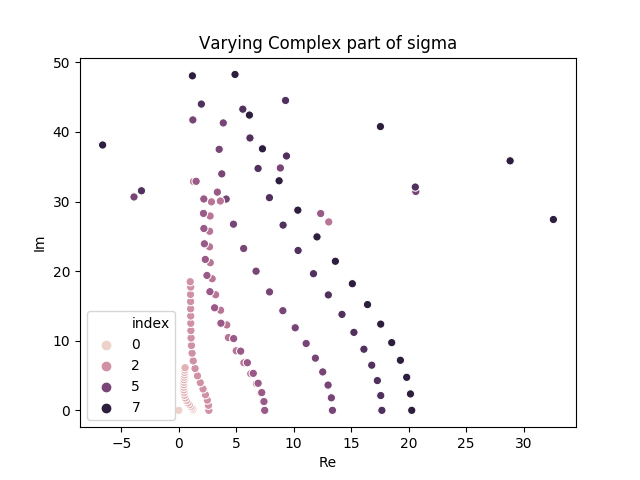

# Lowest Eigenvalue

Eigenvalue problem:
$$
    F_{\textrm{FP}}(x) \psi_n(x) = -\lambda_n \psi_n(x)
$$

The lowest eigenvalue should be $\textrm{Re } \lambda_0 = 0$, and therefore have a distribution following $e^{-\frac12 S}$.

## Models

### Large-Mass Anharmonic Oscillator (LM_AHO)
Using the model with the action
$$
    S = \frac12 \sigma x^2 + \frac14 \lambda x^4 
$$

with the Fokker-Planck operator
$$\begin{aligned}
    F_{\textrm{FP}} =& \frac{\partial}{\partial x} \Gamma (x)\left( \frac{\partial}{\partial x} + \frac{\partial S(x)}{\partial x} \right) \\
    =& \Gamma(x) \left[ \frac{\partial^2}{\partial x^2} + \sigma + \sigma x \frac{\partial}{\partial x} +3 \lambda x^2 + \lambda x^3 \frac{\partial}{\partial x}  \right] \\
    &+ \frac{\partial \Gamma(x)}{\partial x} \left[ \frac{\partial}{\partial x} + \sigma x + \lambda x^3 \right]
  \end{aligned}
$$

For now we set the kernel independent of $x$: $\Gamma(x) = \Gamma$.
$$
    F_{\textrm{FP}} = \Gamma \left[ \frac{\partial^2}{\partial x^2} +\left( \sigma + 3 \lambda x^2 \right) \frac{\partial}{\partial x} + \sigma x \frac{\partial}{\partial x} + \lambda x^3 \right]
$$

#### Modified Fokker-Planck operator ($H_{\textrm{FP}}$)

In the literature, one often transforme the Fokker-Planck equation such that one have $H_{FP} = e^{\frac12 S(x)} F_{\textrm{FP}}e^{-\frac12 S(x)}$. This makes the operator self-asjoint, as long as it is not complex. This is also the operator which have $\lambda_0=0$ The operator in the modifie form is:
$$\begin{aligned}
    H_{FP} =& e^{\frac12 S(x)} F_{\textrm{FP}}e^{-\frac12 S(x)} \\
    =& e^{\frac12 S(x)} \frac{\partial}{\partial x} \Gamma (x)\left( \frac{\partial}{\partial x} + \frac{\partial S(x)}{\partial x} \right)e^{-\frac12 S(x)} \\
    =& \Gamma(x) \left[ \frac{\partial^2}{\partial x^2} - \frac{\sigma^2 x^2}{4} + \frac{3 \lambda x^2}{2} - \frac{\sigma \lambda}{2}x^4 - \frac{\lambda^2}{4}x^6 + \frac\sigma2 \right] \\
    &+ \frac{\partial \Gamma(x)}{\partial x} \left[ \frac{\partial}{\partial x} + \frac12(\sigma x + \lambda x^3) \right]
  \end{aligned}
$$

### Large-Mass Harmonic Oscillator (LM_HO)
Model with action
Using the model with the action
$$
    S = \frac12 \sigma x^2
$$
with the Fokker-Planck operator
$$\begin{aligned}
    F_{\textrm{FP}} =& \frac{\partial}{\partial x} \Gamma (x)\left( \frac{\partial}{\partial x} + \frac{\partial S(x)}{\partial x} \right) \\
    =& \Gamma(x) \left[ \frac{\partial^2}{\partial x^2} + \sigma + \sigma x \frac{\partial}{\partial x}  \right] \\
    &+ \frac{\partial \Gamma(x)}{\partial x} \left[ \frac{\partial}{\partial x} + \sigma x \right]
  \end{aligned}
$$
For now we set the kernel independent of $x$: $\Gamma(x) = \Gamma$.
$$
F_{\textrm{FP}} = \Gamma \left[ \frac{\partial^2}{\partial x^2} + \sigma + \sigma x \frac{\partial}{\partial x} \right] 
$$

#### Modified Fokker-Planck equation
$$\begin{aligned}
    H_{FP} =& \Gamma(x) \left[ \frac{\partial^2}{\partial x^2} - \frac{\sigma^2 x^2}{4}  + \frac\sigma2 \right] \\
    &+ \frac{\partial \Gamma(x)}{\partial x} \left[ \frac{\partial}{\partial x} + \frac12\sigma x \right]
  \end{aligned}
$$

### Discitization
When discritizing summation by parts (http://oddjob.utias.utoronto.ca/dwz/Miscellaneous/SBP_SAT_review.pdf) are used on the double derivative for the boundary condition. The 4(2) order approximation is used, i.e., 4th order approximated finited difference on all but the top and lover square (boundary condition) where it is 2 order approximation.

Setting up with the 4 parameters:
* N: number of dicretization points
* $x_{\textrm{min}}=-100$, $x_{\textrm{max}}=100$: configuration space
* $\sigma = 1 + 0i$
* $\lambda = 2$ (Only relevant for the LM_AHO Model)

### Running tests with varying N
The result of the caluclation of $\lambda_0$ for N=10 to N=500 with a stepsize of 10 is shown i the picture below:

One can see that the real part of the lowest eigenvalue is in general negativ, i.e., it does not follow the theoretical prediction that this should always be positive. As this value is varying, and somtime also positive, it could be that the accuracy when doing the discritization is not good enough until one goes to $N>500$.

#### Update on N>500
Her is the same plot as above only on N>500. The eigenvalues for N>500 increase towards 0, which can mean that for $N\rightarrow \infty$ then $\textrm{Re } \lambda_0 \rightarrow 0$. The LM_HO model is also added, where we can clearly see $\textrm{Re } \lambda_0 \rightarrow 0$ for higher N.
LM_AHO            |  LM_HO
:-------------------------:|:-------------------------:
  |  
  |  

#### Update for N>800
Under is an update fro the LM_AHO model with N ranging from 10 to 2400. After N=800 the stepsize increases from 10 to 100.  

The zooming in on a smaller interval on the x-axis we see that the it still closes inn on 0, where the last value at 2400 is at 0.0001.

#### Update N=4100
The lowest lying eigenvalue have reached the point of not changing too much, very close to 0.0.

### See that eigenvalues are not exact. 
From papers calculating the same eigenvalues, the eigenvalues can be compared to see if they are the same. Comparing with (Klauder 1985: J.Stat.Phys. 39 (1985) 53-72) in the picture below:
.

The plot above varies the sigma parameter in the action. The vayway theave calculated the eigenvalues is by expanding the psobability distribution in the Harmonic Oscillator energy states. 

The figure above show that the eigenvalues follow the same pattern as for Klauder 1985. This is for the 8 first eigenvalues, and sigma is varied from $\sigma=1+0i$ to $\sigma=1+15i$. For higher imagenary part of the sigma, the pattern dissapear:

which could mean that we need a higher number of discretization points or a higher second derivative approximation order. The plots above is for $N=500$.

#### Update 1
The reason why the the eigenvalues "go off course" at high Im $\sigma$ could be due to the volume of the box I simulate in. So the $x_{\textrm{min}}$ and $x_{\textrm{max}}$ should be increased. 

### Need higher N when looking at higher eigenvalue

Plot above using the LM_AHO model with varying N for the 10 first eigenvalues. Other parameters same as above.

It seems like the eigenvalues for the LM_AHO model comes in pairs, and I need a value of N above a limit to "split" them. This is what we see on the picture for varying the imaginary part of $\sigma$.

#### Update N>800
With the new data on N>800 the same plot as above is plotted with the 12 first eigenvalues. The 3 lowest lying eigenvalues does not change that much, and seems to be constant at this scale. The two next eigenvalues are quite intereting, as they combined again around N=1500. 

#### Update N=4100
At this point the interesting two wigenvalues from the above update continues to cross, and somehow splits again (switching order).

The eigenvalues above this seem to still change, and might cross over eachother at some later N.