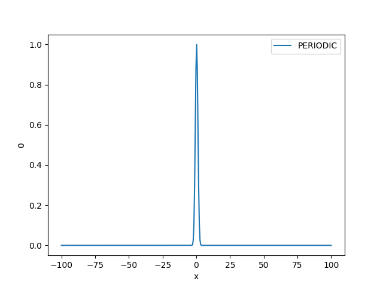
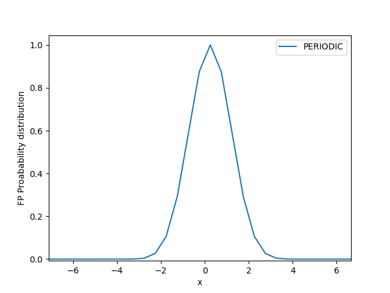
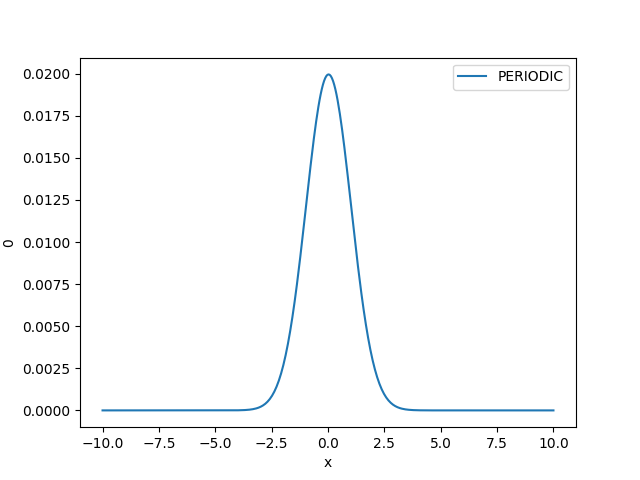
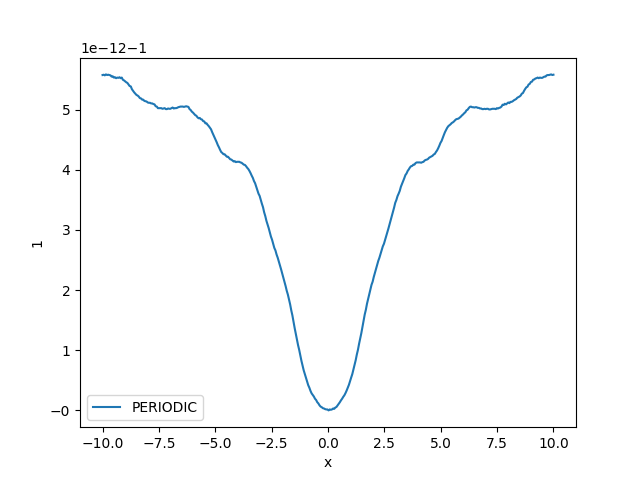
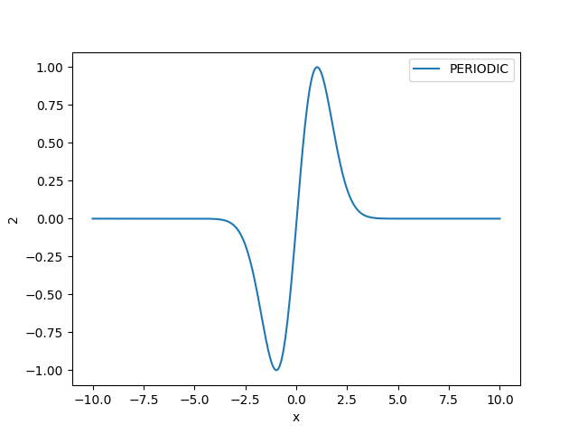
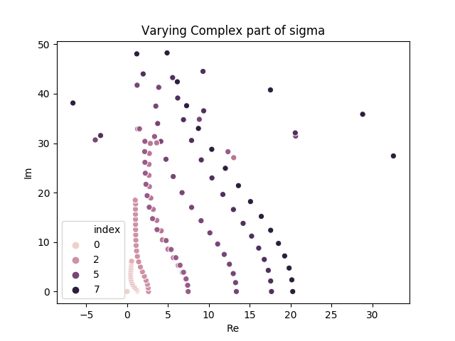
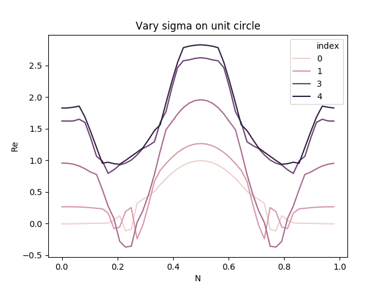

# Analysing the probablity distribution

Calculations of the eigenvalues have been done one the volume -100 to 100. In this note I will look into if this is to high of a volume or if it should be bigger

## The probability distribution
The Fokker-Planck equation is:
$$
    \frac{d}{dt}\Phi(x;t) = F_{\textrm{FP}} \Phi(x;t) 
$$
where
* $\Phi(x,t)$ is the probability distribution (this is the same as $|\psi(x;t)|^2$ in quantum mechanincs)
* $F_{\textrm{FP}}$ is the Fokker-Planck operator

We can convert this into a time-independent eigenvalue problem by seperation of variable:
$$
    \Phi(x;t) = P(x)\phi(t)
$$

The time-independent Fokker-Planck equation therefor becomes:
$$
    F_{\textrm{FP}} P(x) = \lambda_n P(x)
$$

We have until now only considered the eigenvalues of the problem above. The eigenvectors, which is the probability distribution is also possible to get out of the eigensolvers (Using Eigen at this point)

This means that the corresponding eigenvector for the first eigenvalue should give the greound state probability distribution. 

## Plotting Probability distribution
### Fokker-Planck Operator ($H_{\textrm{FP}}$)
For the previous test I have in general used the volume $x_{\textrm{min}} = -100$ to $x_{\textrm{max}}=100$, which turns out to be way to large for the models I have looked at. Here is an example of the probability distribution for the lowest eigenvalue in the LM_HO model with $\sigma = 1$ on the full intervall ([-100,100]) using $N=400$:

In the distribution above there are alot of points that are 0, meaning these point is unnecceary to include in the calculation of the eigenvalues. In an ideal calculation one should go to infinity, but this is not possible to do on computers. Setting 100 as above we "waist" computational resorces on calculating the uninteresting part of 0 probability distribution. This means that there are less points available to inerprete the curve. Zooming in we see that we not much higher N to make the probability distribution smooth:

### Decreasing the volume
We can see from the plot above that we do not need a larger interval than [-10.10], this makes the distribution smooth:

### The next eigenvalue
As the order of the eigenvalues is not, at this point, after which eigenvalue is the lowest it is hard to find which eigenvector it is:

The third seems to be the second

**PROBLEM:** This should not be negative?

### The modified Fokker-Planck operator ($H_{\textrm{FP}}$)
 We have also looked at the eigenvalues of the modidified Fokker-Planck operator ($H_{\textrm{FP}}$), where we moostly look if the lowest eigenvalue is $\lambda_0 = 0$. Here is an example of the probability distribution for the lowest eigenvalue in the LM_HO model with $\sigma = 1$ on the full intervall ([-100,100]) using $N=200$:

Zooming in we see that we not much higher N to make the probability distribution smooth:

### Decreasing the valume

### The next eigenvalue

## Testing cases where the eigenvalue behaves strange

### High Im($\sigma$)
When we previously varied $\sigma$ in LM_HO model (having the action $S = \frac12 \sigma x^2$) we got:

For high values of $Im(\sigma)$ the we clearly get the wrong result.
Plotting the probability distribution for $Im(\sigma)$ we can clearly see why.
.....
Plot above is for N=..., volume=..., ..... (This is for $H_{\textrm{FP}}$)

If we know plot for the old volume: V=-100 to 100, we can see that the answare at high $Im(\sigma)$ does not make sense. 

### When the eigenvalues oscillate in "on the unite circle"
When we analysed that all the eigenvalues of $F_{\textrm{FP}}$ when changing $\sigma$ on the complex unit circle, we got some oscillations when $\sigma$ was close to $Re(\sigma)=0$ and $Im(\sigma) = \pm 1$. Plot below show the eigenvalues for the $H_{\textrm{FP}}$

(Cannot explain why area the lowest igenvalue between 0.25 and 0.75 is higher than 0.)

By looking at the probability distribution along the unit circle the first one is the same as the $\sigma = 1$ distributions above, then a subset of them is plotted under:

| n        | $\lambda_0$           | $\lambda_1$  | 
| ------------- |:-------------:|:-----:| 
6 | _isin(6pi_25)_N_200_on_-10-10_EVecNr_0_PERIODIC.png) | _isin(6pi_25)_N_200_on_-10-10_EVecNr_1_PERIODIC.png) |
12 | _isin(12pi_25)_N_200_on_-10-10_EVecNr_0_PERIODIC.png) | _isin(12pi_25)_N_200_on_-10-10_EVecNr_1_PERIODIC.png) |
13 | _isin(13pi_25)_N_200_on_-10-10_EVecNr_0_PERIODIC.png) | _isin(13pi_25)_N_200_on_-10-10_EVecNr_1_PERIODIC.png) |
15 | _isin(15pi_25)_N_200_on_-10-10_EVecNr_0_PERIODIC.png) | _isin(15pi_25)_N_200_on_-10-10_EVecNr_1_PERIODIC.png) |

We can clearly see at close to n = 12.5 that the distribution oscillate very much. This is the reason for the eigenspectrum tro fail at this region when using the range [-100,100].

| n=12   | n=13  | 
| ------------- |:-------------:| 
| _isin(12pi_25)_N_500_on_-100-100_EVecNr_0_PERIODIC_ZOOMED.png) | _isin(13pi_25)_N_500_on_-100-100_EVecNr_0_PERIODIC_ZOOMED.png) |
